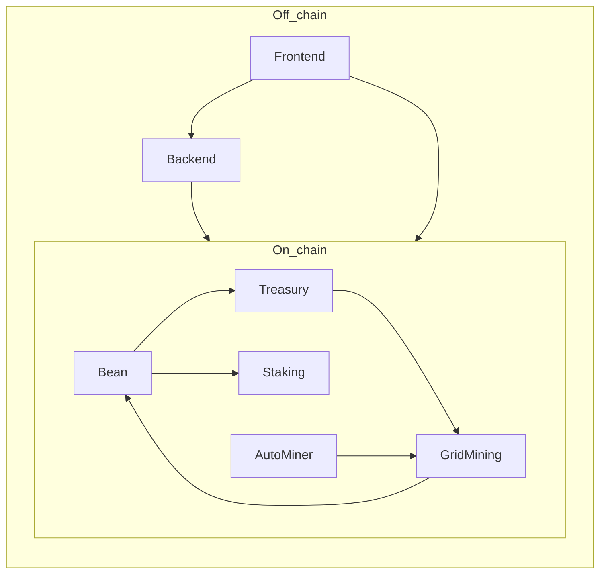

# BNBEAN / Mine Bean — Full system runbook

**Who this is for:** You want the whole stack working end-to-end (contracts → backend → website) and you are OK following steps in order.

**How to use this doc:** Work **top to bottom**. When a step says “save these addresses,” paste them into a notes file before continuing. For deeper detail or troubleshooting, follow the links to the other guides.

**Related guides (read these when you need more depth):**

| Doc | Purpose |
|-----|---------|
| [DEPLOYMENT_GUIDE.md](DEPLOYMENT_GUIDE.md) | Prerequisites, troubleshooting, verification tables |
| [POST_DEPLOYMENT_GUIDE.md](POST_DEPLOYMENT_GUIDE.md) | Pool, TWAP, VRF, Render/Vercel, long troubleshooting |
| [PRE_LAUNCH_CHECKLIST.md](PRE_LAUNCH_CHECKLIST.md) | Final QA before users touch the product |
| [SYSTEM_VERIFICATION_CHECKLIST.md](SYSTEM_VERIFICATION_CHECKLIST.md) | Env vars, production-shaped checks |
| [DOCKER.md](DOCKER.md) | Docker-only dev notes |
| [SHIPPING_ANALYSIS.md](SHIPPING_ANALYSIS.md) | GridMining checkpoint features vs deployed address |

---

## Part 0 — Linear checklist (minute-by-minute order)

Follow **Step 1 → Step N** in order. Each step tells you **where** (folder), **what** (command or action), and **done when** (how you know it worked).

**Paths:** Below, `mine-bean` means your cloned repo root (the folder that contains `package.json`, `hardhat/`, `Backend/`, and `docker-compose.yml`).

**Windows PowerShell:** chain commands with `;` (e.g. `cd hardhat; npm install`). **macOS/Linux Bash:** you can use `&&` (e.g. `cd hardhat && npm install`).

---

### Phase 0 — One-time accounts (no repo folder yet)

| Step | Where | What to do | Done when |
|------|--------|------------|-----------|
| 0.1 | Browser | Create/get **MetaMask** (or another EVM wallet). | You have a seed phrase stored safely. |
| 0.2 | Browser | Add **BSC Testnet** (Chain ID **97**). Get **tBNB** from [BNB Chain faucet](https://www.bnbchain.org/en/testnet-faucet). | Wallet shows a tBNB balance greater than 0. |
| 0.3 | Browser | Create **Chainlink VRF** subscription at [vrf.chain.link](https://vrf.chain.link) for **BNB Chain Testnet**. Fund with **testnet LINK** ([Chainlink faucet](https://faucets.chain.link/bnb-testnet)). | You have `VRF_SUBSCRIPTION_ID` (number) and note the **coordinator** address + **gas lane key hash** from [supported networks](https://docs.chain.link/vrf/v2-5/supported-networks). |
| 0.4 | Browser (optional) | [BscScan API key](https://bscscan.com/myapikey) for contract verification. | Key saved for `hardhat/.env`. |
| 0.5 | Browser | **MongoDB Atlas** free cluster OR skip if you will use Docker-only Mongo (Phase 4A). | You have `MONGODB_URI` *or* you plan `docker compose` only. |
| 0.6 | Browser (optional) | **Supabase** project for profiles. | `NEXT_PUBLIC_SUPABASE_URL` + anon key. |
| 0.7 | Your PC | Install **Node.js (LTS)** and **npm**. Install **Git**. Optional: **Docker Desktop**. | `node -v` and `npm -v` work in a terminal. |

---

### Phase 1 — Clone repo and deploy contracts

| Step | Where | What to do | Done when |
|------|--------|------------|-----------|
| 1.1 | Parent folder (e.g. `Documents\GitHub`) | `git clone <your-repo-url> mine-bean` then `cd mine-bean` | You see `package.json`, `hardhat`, `Backend` inside `mine-bean`. |
| 1.2 | `mine-bean/hardhat/` | Create file **`hardhat/.env`** (not committed). Use **Part C → C.1** and the minimal example in Phase 1 below. | File exists with `DEPLOYER_PRIVATE_KEY`, `VRF_COORDINATOR`, `VRF_SUBSCRIPTION_ID`, `VRF_KEY_HASH`, `PANCAKESWAP_ROUTER` (testnet: `0xD99D1c33F9fC3444f8101754aBC46c52416550D1`). |
| 1.3 | `mine-bean/hardhat/` | `npm install` | Completes without errors. |
| 1.4 | `mine-bean/hardhat/` | `npm run compile` | `Compiled ... successfully`. |
| 1.5 | `mine-bean/hardhat/` | `npm run deploy:testnet` | Terminal prints **five addresses**: Bean, Treasury, GridMining, AutoMiner, Staking. |
| 1.6 | Your notes | Copy all five addresses to a text file labeled **TESTNET_DEPLOY.txt**. | You never lose them. |

**Minimal `hardhat/.env` example (testnet):**

```env
DEPLOYER_PRIVATE_KEY=YOUR_KEY_WITHOUT_0x
RPC_URL=https://data-seed-prebsc-1-s1.binance.org:8545
BSCSCAN_API_KEY=
VRF_COORDINATOR=0x_paste_from_chainlink_docs
VRF_SUBSCRIPTION_ID=12345
VRF_KEY_HASH=0x_paste_from_chainlink_docs
PANCAKESWAP_ROUTER=0xD99D1c33F9fC3444f8101754aBC46c52416550D1
```

---

### Phase 2 — VRF consumer + start game (on-chain)

| Step | Where | What to do | Done when |
|------|--------|------------|-----------|
| 2.1 | [vrf.chain.link](https://vrf.chain.link) | Open your subscription → **Consumers** → Add **GridMining** address from TESTNET_DEPLOY.txt. | Consumer list shows GridMining. |
| 2.2 | `mine-bean/hardhat/` | `npx hardhat console --network bscTestnet` | JavaScript prompt appears. |
| 2.3 | Inside Hardhat console | Run the snippet under this table (replace `0xGRID` with your GridMining address). | Transaction succeeds; `await gm.gameStarted()` is `true`. |
| 2.4 | Exit console | `.exit` or Ctrl+D | Back to shell. |

**Step 2.3 — paste in the console:**

```javascript
const gm = await ethers.getContractAt("GridMining", "0xGRID")
await (await gm.startFirstRound()).wait()
```

---

### Phase 3 — Sync code with chain (must match deploy)

| Step | Where | What to do | Done when |
|------|--------|------------|-----------|
| 3.1 | `mine-bean/lib/contracts.ts` | Replace `GridMining`, `Bean`, `AutoMiner`, `Treasury`, `Staking` addresses with TESTNET_DEPLOY.txt values. Leave `LP` if no pool yet, or set after Step 4. | File saves; no typos in `0x` lengths. |
| 3.2 | `mine-bean/docker-compose.yml` | Under `backend.environment`, set `GRIDMINING_ADDRESS`, `BEAN_ADDRESS`, `AUTOMINER_ADDRESS`, `TREASURY_ADDRESS`, `STAKING_ADDRESS` to the same five. | Matches `lib/contracts.ts`. |
| 3.3 | `mine-bean/Backend/.env` | Create if missing. Set `PORT=3001`, `MONGODB_URI=...`, `RPC_URL=https://bsc-testnet-dataseed.bnbchain.org` (or preferred RPC), plus the same five `*_ADDRESS` vars. | Backend can read env (see Part E). |
| 3.4 | `mine-bean/hardhat/` | `npm run compile` then `npm run sync-abis` | Console prints `Synced ...` for Bean, Treasury, GridMining, AutoMiner, Staking. |
| 3.5 | Quick check | Open `lib/abis/GridMining.json` — first line should be `[` (ABI array). | ABI files updated. |

---

### Phase 4 — Run app locally

**Pick ONE path: 4A Docker OR 4B manual.**

#### 4A — Docker (Mongo + backend + frontend)

| Step | Where | What to do | Done when |
|------|--------|------------|-----------|
| 4A.1 | `mine-bean/` (root) | Optional: create `.env` in root with Supabase vars only. | Optional. |
| 4A.2 | `mine-bean/` | `docker compose up --build` | Logs show backend listening on 3001, frontend on 3000. |
| 4A.3 | Any terminal | `curl http://localhost:3001/health` | JSON with `"status":"ok"` and mongo connected. |
| 4A.4 | Browser | Open `http://localhost:3000` — connect wallet on **BSC Testnet**. | Site loads; wallet connects. |

#### 4B — Manual (two terminals)

| Step | Where | What to do | Done when |
|------|--------|------------|-----------|
| 4B.1 | `mine-bean/Backend/` | `npm install` then `npm run dev` | Server says listening on 3001 (or PORT from .env). |
| 4B.2 | `mine-bean/` (root) | Create **`.env.local`**: `NEXT_PUBLIC_API_URL=http://localhost:3001` (+ optional Supabase). | File exists. |
| 4B.3 | `mine-bean/` | `npm install` then `npm run dev` | Next.js ready on 3000. |
| 4B.4 | Browser | `http://localhost:3000` + BSC Testnet | Same as 4A.4. |
| 4B.5 | Any terminal | `curl http://localhost:3001/health` | Same as 4A.3. |

---

### Phase 5 — Play one full round (prove mining + VRF)

| Step | Where | What to do | Done when |
|------|--------|------------|-----------|
| 5.1 | App + wallet | Deploy tBNB to one or more grid blocks before round ends. | Tx succeeds; grid updates. |
| 5.2 | When timer hits 0 | Click **Reset** in UI *or* ensure backend has `RESET_WALLET_PRIVATE_KEY` for auto-reset (see **Part G** below). | `reset` tx submitted. |
| 5.3 | Wait | ~30–120s for VRF fulfillment. | Round settles; winners UI updates / SSE events. |
| 5.4 | If you won | **Checkpoint** then **Claim** in Rewards card. | Pending rewards → claims succeed. |

---

### Phase 6 — Liquidity + TWAP (for treasury buybacks / price)

Do **after** you have some BNBEAN (from winning rounds) unless you use another way to seed the pool. Order follows [POST_DEPLOYMENT_GUIDE.md](POST_DEPLOYMENT_GUIDE.md).

| Step | Where | What to do | Done when |
|------|--------|------------|-----------|
| 6.1 | PancakeSwap testnet | Add **BNBEAN/WBNB** liquidity; get **pair** address from tx or factory `getPair`. | Pair `0x...` saved. |
| 6.2 | Hardhat console | `bean.setPair(pairAddress)` then `updateReserveSnapshot()` **3+ times** waiting **4+ seconds** between each. | `await bean.isTWAPReady()` is `true`. |
| 6.3 | `mine-bean/lib/contracts.ts` | Set `LP.address` to pair. | Matches Pancake pair. |
| 6.4 | Restart | Docker: `docker compose down` then `up --build`. Manual: restart Backend + Frontend if needed. | Fresh config loaded. |

---

### Phase 7 — AutoMiner + auto-reset (production comfort)

| Step | Where | What to do | Done when |
|------|--------|------------|-----------|
| 7.1 | `Backend/.env` (or Render env) | Set `RESET_WALLET_PRIVATE_KEY=0x...` (funded with tBNB). Optional: `AUTO_RESET_ENABLED=true`. | Rounds reset without manual UI button. |
| 7.2 | Same file | Set `EXECUTOR_PRIVATE_KEY=0x...` to the wallet that is **`AutoMiner.executor()`** on-chain (deploy script uses deployer). Fund with tBNB. | Backend logs show AutoMiner execution; UI round counter advances. |
| 7.3 | Restart backend | `docker compose down && docker compose up --build` *or* stop/start `npm run dev` in Backend. | New env active. |

---

### Phase 8 — Verify and ship checklist

| Step | Where | What to do | Done when |
|------|--------|------------|-----------|
| 8.1 | Terminal | `curl http://localhost:3001/api/stats/diagnostic` | `beanAddressMatch: true`, `minterMatchesGridMining: true` (or follow `fixHint`). |
| 8.2 | `mine-bean/` | `npm run test:run` | Tests pass (optional but good). |
| 8.3 | Human | Open [PRE_LAUNCH_CHECKLIST.md](PRE_LAUNCH_CHECKLIST.md) and tick every row. | Confident for users. |

---

### Phase 9 — Production (Render + Vercel) — shorthand

| Step | Where | What to do | Done when |
|------|--------|------------|-----------|
| 9.1 | MongoDB Atlas | Network access `0.0.0.0/0`, user + connection string. | `MONGODB_URI` for Render. |
| 9.2 | Render | New Web Service, root dir **`Backend`**, build `npm install`, start `npm start`, paste all env vars from [POST_DEPLOYMENT_GUIDE.md](POST_DEPLOYMENT_GUIDE.md) (five addresses + RPC + Mongo + optional reset/executor keys). | `curl https://YOUR-SERVICE.onrender.com/health` returns ok. |
| 9.3 | Vercel | Import repo, root **`.`**, env: `NEXT_PUBLIC_API_URL`, `INTERNAL_API_URL` = Render URL, optional Supabase. | Live URL loads and talks to API. |

---

**After this Part 0:** use **Part A–J** below for concepts, troubleshooting links, and duplicate reference. The table above is the **single ordered path**.

---

## Part A — What you are actually running

### Five smart contracts (on BNB Chain)

The deploy script deploys them in this **order** (each step needs the previous):

1. **Bean (BNBEAN)** — ERC-20; only the minter (GridMining) mints rewards.
2. **Treasury** — Holds vaulted BNB, runs buybacks using Bean’s TWAP; needs the Pancake router address at deploy time.
3. **GridMining** — The game: rounds, deploy, VRF settlement, checkpoints, claims. Talks to Bean + Treasury + Chainlink VRF.
4. **AutoMiner** — Users lock BNB and a strategy; an **executor** wallet calls the contract each round to deploy for them.
5. **Staking** — Users stake BNBEAN; yield comes from treasury buybacks.

After deploy, the script also **wires** them: Bean minter → GridMining, GridMining ↔ AutoMiner, Treasury ↔ GridMining/Staking, and VRF config if your `.env` has subscription id + key hash.

### Off-chain software

- **Backend** (`Backend/`) — REST API, MongoDB indexer, SSE streams. Optionally calls `reset()` and AutoMiner `executeFor` if you set private keys in `.env`.
- **MongoDB** — Stores rounds/deployments for the UI and APIs.
- **Frontend** (Next.js at repo root) — Wallet, grid, claims, staking pages. Reads contract addresses from `lib/contracts.ts` and API from `NEXT_PUBLIC_API_URL`.
- **Supabase (optional)** — User profiles (username, pfp); not required for mining.

### Why addresses must match everywhere

GridMining **mints** BNBEAN to the **Bean** address it was constructed with. If the frontend or backend points at a **different** Bean or GridMining than the chain, you will see zeros, failed claims, or “nothing to claim.” After every redeploy, update **all** places listed in Part E.



---

## Part B — Prerequisites (gather before Day 1)

- [ ] **Wallet** (e.g. MetaMask) with **BSC Testnet** (chain id **97**) for testnet work — [BNB Chain faucet](https://www.bnbchain.org/en/testnet-faucet) for tBNB.
- [ ] **Chainlink VRF** — Subscription on [vrf.chain.link](https://vrf.chain.link) for BSC Testnet; fund with **testnet LINK** ([faucet](https://faucets.chain.link/)). You need `VRF_COORDINATOR`, `VRF_SUBSCRIPTION_ID`, and `VRF_KEY_HASH` from [Chainlink docs](https://docs.chain.link/vrf/v2-5/supported-networks) for your network.
- [ ] **BscScan API key** (optional but useful) — [bscscan.com/myapikey](https://bscscan.com/myapikey) for `hardhat verify`.
- [ ] **MongoDB** — Either local via Docker (see Part F) or [MongoDB Atlas](https://www.mongodb.com/cloud/atlas) connection string.
- [ ] **Supabase** (optional) — Project URL + anon key for profile features.
- [ ] **Node.js** + **npm** installed.
- [ ] **Docker Desktop** (optional) — If you use `docker compose` for local full stack.

**Security:** Never commit `hardhat/.env`, `Backend/.env`, or `.env.local` with real keys. Add them to `.gitignore` if you ever create local files that are not ignored.

---

## Part C — Phase 1: Deploy contracts (Hardhat)

### C.1 Create `hardhat/.env`

**Directory for this section:** create/edit the file inside **`hardhat/`** (same folder as `hardhat.config.js`).

Example (testnet). Replace placeholders with your values:

```env
DEPLOYER_PRIVATE_KEY=your_private_key_without_0x_prefix
RPC_URL=https://data-seed-prebsc-1-s1.binance.org:8545
BSCSCAN_API_KEY=your_bscscan_api_key

VRF_COORDINATOR=0x...   # from Chainlink BSC testnet docs
VRF_SUBSCRIPTION_ID=your_numeric_subscription_id
VRF_KEY_HASH=0x...      # from Chainlink docs for BSC testnet

PANCAKESWAP_ROUTER=0xD99D1c33F9fC3444f8101754aBC46c52416550D1
```

Optional:

```env
BUYBACK_THRESHOLD=0.01
EXECUTOR_FEE_BPS=100
EXECUTOR_FLAT_FEE=0.000006
```

Mainnet: use mainnet RPC, mainnet VRF values, and router `0x10ED43C718714eb63d5aA57B78B54704E256024E` (see [DEPLOYMENT_GUIDE.md](DEPLOYMENT_GUIDE.md)).

### C.2 Install, compile, deploy

Open a terminal.

**Windows (PowerShell):** use `;` between commands when chaining.

```powershell
cd hardhat
npm install
npm run compile
npm run deploy:testnet
```

Equivalent:

```powershell
cd hardhat
npx hardhat run scripts/deploy.js --network bscTestnet
```

Mainnet (only after audit and real funds):

```powershell
cd hardhat
npm run deploy:mainnet
```

### C.3 Save the output

The script prints **five addresses**. Copy them to a secure note:

- Bean (BNBEAN)
- Treasury
- GridMining
- AutoMiner
- Staking

You will paste these into `lib/contracts.ts`, `docker-compose.yml`, Backend/Render env, etc.

### C.4 Important: “I only changed GridMining in Solidity”

The default **`scripts/deploy.js`** always deploys a **new Bean and full stack**. It does **not** upgrade a single contract in place.

If you deploy a **new** GridMining **without** redeploying everything, you must manually: point `bean.setMinter` at the new GridMining, call `gridMining.setAutoMiner`, `treasury.setGridMining`, set VRF config again, add the new consumer on vrf.chain.link, and accept that **old game state lives on the old GridMining**. For testnet iteration, **full redeploy** is the simple, documented path.

---

## Part D — Phase 2: On-chain steps after deploy

Do these in **roughly** this order (pool can wait until you have BNBEAN from gameplay).

| Step | What | Why |
|------|------|-----|
| 1 | Add **GridMining** contract address as a **consumer** on your VRF subscription at [vrf.chain.link](https://vrf.chain.link) | Without this, VRF never fulfills and rounds never settle with randomness |
| 2 | Call **`gridMining.startFirstRound()`** | Starts the first 60s round (game can run **before** liquidity pool exists) |
| 3 | Play rounds, **`reset()`** when timer ends (or enable auto-reset in Part G), wait for VRF | Confirms end-to-end settlement and BNBEAN minting |
| 4 | Create **BNBEAN/WBNB** pool on **PancakeSwap V2** (testnet) | Treasury buybacks need a pool |
| 5 | **`bean.setPair(<pairAddress>)`** | Bean TWAP needs the pair |
| 6 | **`bean.updateReserveSnapshot()`** at least **3** times, **one new block between each** (~3–4s on BSC testnet) | Until this, `TWAPNotReady`-style failures can block buybacks |
| 7 | Update **`LP.address`** in `lib/contracts.ts` with the pair address | Header / price widgets use it |

### Using Hardhat console (pattern)

**Directory:** `hardhat/`

```powershell
cd hardhat
npx hardhat console --network bscTestnet
```

Then (replace addresses with **yours**):

```javascript
const gridMining = await ethers.getContractAt("GridMining", "0xYOUR_GRIDMINING")
await (await gridMining.startFirstRound()).wait()
```

Same idea for `Bean`, `bean.setPair`, `bean.updateReserveSnapshot`.

### Optional: verify on BscScan

See [POST_DEPLOYMENT_GUIDE.md](POST_DEPLOYMENT_GUIDE.md) Step 7. **Always substitute your deployed addresses and constructor args** — do not copy historical example addresses from old docs.

### Optional: freeze minter (mainnet, late stage)

When you are sure the game is correct, Bean owner can call **`freezeMinter()`** so the minter address can never change again. **Irreversible** — only after you trust deployment.

---

## Part E — Phase 3: Sync the repo with the chain

After **any** contract deploy or ABI change:

### E.1 Frontend addresses — `lib/contracts.ts`

Edit [lib/contracts.ts](lib/contracts.ts):

- `GridMining.address`
- `Bean.address`
- `AutoMiner.address`
- `Treasury.address`
- `Staking.address`
- `LP.address` (pair from Pancake; can be placeholder until pool exists)

Confirm **`MIN_DEPLOY_PER_BLOCK`**, **`EXECUTOR_FEE_BPS`**, **`EXECUTOR_FLAT_FEE`** still match the deployed contracts (comments in file).

### E.2 Docker — `docker-compose.yml`

If you use Docker, update the `backend.environment` block in [docker-compose.yml](docker-compose.yml):

- `GRIDMINING_ADDRESS`
- `BEAN_ADDRESS`
- `AUTOMINER_ADDRESS`
- `TREASURY_ADDRESS`
- `STAKING_ADDRESS`

Optional: set `RPC_URL` for the backend via shell env when running compose (see file for `${RPC_URL:-...}`).

### E.3 Backend — `Backend/.env` or Render dashboard

Set the same five addresses (and `MONGODB_URI`, `RPC_URL`, `PORT=3001`). [Backend/lib/contracts.js](Backend/lib/contracts.js) has **fallback** addresses in code — in production, **always set env vars** so you never accidentally read the wrong deployment.

### E.4 ABIs (after `npm run compile` in `hardhat/`)

If Solidity interfaces changed (e.g. new GridMining functions), copy ABIs into the repo:

**Option A — npm script (recommended):**

```powershell
cd hardhat
npm run sync-abis
```

**Option B — one-liner** (GridMining only example):

```powershell
cd hardhat
node -e "const fs=require('fs');const p='artifacts/contracts/GridMining.sol/GridMining.json';const a=JSON.parse(fs.readFileSync(p,'utf8'));const s=JSON.stringify(a.abi,null,2);fs.writeFileSync('../lib/abis/GridMining.json',s);fs.writeFileSync('../Backend/abis/GridMining.json',s);console.log('GridMining ABI synced');"
```

The `sync-abis` script syncs **Bean, Treasury, GridMining, AutoMiner, Staking** to both `lib/abis/` and `Backend/abis/`.

---

## Part F — Phase 4: Run backend + frontend

### Option A — Docker (good for “just run everything”)

**Directory:** repo **root** (folder that contains `docker-compose.yml`).

```powershell
docker compose up --build
```

- Frontend: [http://localhost:3000](http://localhost:3000)
- Backend: [http://localhost:3001](http://localhost:3001)

Check health:

```powershell
curl http://localhost:3001/health
```

Optional root `.env` for Supabase (see [POST_DEPLOYMENT_GUIDE.md](POST_DEPLOYMENT_GUIDE.md) Step 8).

After **backend code** changes, rebuild:

```powershell
docker compose down
docker compose up --build
```

### Option B — Manual npm

**Terminal 1 — Backend**

```powershell
cd Backend
npm install
npm run dev
```

**Terminal 2 — Frontend** (repo root)

Create **`.env.local`** in the repo root:

```env
NEXT_PUBLIC_API_URL=http://localhost:3001
NEXT_PUBLIC_SUPABASE_URL=
NEXT_PUBLIC_SUPABASE_ANON_KEY=
```

Then:

```powershell
npm install
npm run dev
```

Open [http://localhost:3000](http://localhost:3000). In MetaMask, select **BSC Testnet** (chain id 97).

### Option C — Production-shaped (Render + Vercel)

Summary — full tables in [POST_DEPLOYMENT_GUIDE.md](POST_DEPLOYMENT_GUIDE.md) “Deploy to Render + Vercel”:

- **Render:** root directory `Backend`, `npm install` / `npm start`, env vars for MongoDB URI, RPC URL, five contract addresses, optional `RESET_WALLET_PRIVATE_KEY`, `EXECUTOR_PRIVATE_KEY`.
- **Vercel:** `NEXT_PUBLIC_API_URL` = your Render URL, `INTERNAL_API_URL` = same URL (for Next.js API routes that proxy to the backend).

---

## Part G — Phase 5: Operator automation (optional but important)

Without these, you must **manually** call **`reset()`** on GridMining after each round ends, and **manually** run something that calls AutoMiner **`executeFor`** for each user.

Add to **Backend** `.env` (or Render):

| Variable | Purpose |
|----------|---------|
| `RESET_WALLET_PRIVATE_KEY` | Wallet with tBNB/BNB that sends `GridMining.reset()` |
| `AUTO_RESET_ENABLED` | Default true if key set; set `false` to disable |
| `EXECUTOR_PRIVATE_KEY` | Must match on-chain `AutoMiner.executor()` (usually deployer) |
| `AUTO_MINER_EXECUTOR_ENABLED` | Omit key or set false to disable executor loop |
| `AUTO_MINER_EXECUTOR_POLL_MS` | Default 15000 (15s) |

Fund both wallets with a small amount of native token for gas.

Details: [POST_DEPLOYMENT_GUIDE.md](POST_DEPLOYMENT_GUIDE.md) sections “Auto-reset” and “AutoMiner executor”.

---

## Part H — Verification commands

Run from any directory unless noted.

```powershell
# Backend up and Mongo connected
curl http://localhost:3001/health

# Deep contract sanity (Bean minter, address match, hints)
curl http://localhost:3001/api/stats/diagnostic
```

Frontend tests (repo root):

```powershell
npm run test:run
```

Contract tests:

```powershell
cd hardhat
npx hardhat test
```

---

## Part I — When something breaks (quick pointers)

| Symptom | Check |
|---------|--------|
| VRF never settles | GridMining added as consumer? Subscription has **LINK**? Correct `VRF_COORDINATOR` / key hash? |
| TWAP / buyback errors | `setPair` done? `updateReserveSnapshot` 3+ times across blocks? |
| Zeros on rewards | `/api/stats/diagnostic` — `beanAddressMatch`, `minterMatchesGridMining` ([POST_DEPLOYMENT_GUIDE.md](POST_DEPLOYMENT_GUIDE.md) BNBEAN section) |
| Frontend wrong network | MetaMask chain vs [lib/wagmi.ts](lib/wagmi.ts) (`bsc` / `bscTestnet`) |
| Indexer rate limits | Paid RPC; `INDEXER_POLL_INTERVAL_MS` in Backend `.env` |
| AutoMiner 0 rounds | `EXECUTOR_PRIVATE_KEY` set and funded? Matches `executor()` on contract? |
| Docker frontend oddities | `INTERNAL_API_URL=http://backend:3001` is set in compose for API routes |

Full tables: [DEPLOYMENT_GUIDE.md](DEPLOYMENT_GUIDE.md) §5.

---

## Part J — Final QA before users

Walk through **[PRE_LAUNCH_CHECKLIST.md](PRE_LAUNCH_CHECKLIST.md)** (mining, checkpoint, claim, AutoMiner, staking, Global, mobile, SSE).

For production env completeness, also use **[SYSTEM_VERIFICATION_CHECKLIST.md](SYSTEM_VERIFICATION_CHECKLIST.md)**.

---

## Appendix — Improvements backlog (optional follow-ups)

These are **not** required to run the system; they are sensible next iterations:

| Area | Idea |
|------|------|
| Docs | Keep verify examples strictly “your addresses from deploy output” |
| Tooling | `npm run sync-abis` in `hardhat/` (see above) |
| UI | Wire **MobileMiners** to `/api/round/:id/miners` like desktop MinersPanel |
| UI | Optional **`checkpointBatch`** button for power users |
| Ops | Scripted “GridMining-only” migration if you outgrow full redeploys |
| Security | `hardhat test`, Slither, or audit before mainnet; then `bean.freezeMinter()` when stable |

---

*This runbook is the single ordered path; detailed prose and edge cases live in the linked guides.*
